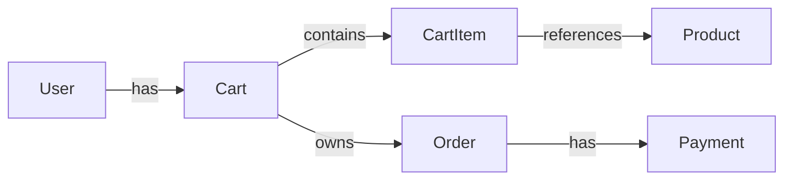

# Feature Landscape

Before writing code, draw the territory. The landscape is an entity graph plus a layer map plus a list of integration points. It exists so the team can talk about the feature *as data and boundaries* before arguing about UI, frameworks, or coding style.

> **Related skills:**
> - `feature-requirements` — produces Primary/Secondary inputs this skill consumes
> - `feature-estimation` — multiplies the work-items list by mobile multipliers
> - `arch-mvvm` / `arch-mvi` / `arch-clean` / `arch-viper` / `arch-tca` — chosen UI architecture refines the Presentation layer; pick via `architecture-choice` if open
> - `arch-coordinator` / `arch-swiftui-navigation` — navigation layer of the landscape
> - `net-architecture` — Networking layer specifics (HTTPClient, interceptors, retry, pagination)
> - `net-openapi` — when API has an OpenAPI spec
> - `persistence-architecture` — Repository / local-storage layer specifics
> - `error-architecture` — error mapping between layers shown on the graph
> - `concurrency-architecture` — where `@MainActor` lives, Task ownership across the layers
> - `pkg-spm-design` — when a layer crosses a package boundary
> - `di-composition-root` / `di-module-assembly` — how the graph is wired at runtime

## When to use

- New feature, after `feature-requirements` produced `Research.md ## Requirements`
- Refactor of an unclear area — to capture **current** landscape before designing the target (`workflow-refactor` Analyze stage produces *both* a current and a target landscape)
- Epic decomposition — landscape's work-items list seeds the `.step/` split (`workflow-epic` Plan stage)
- Direct invocation when the user asks "what's the shape of this feature?" / "what are the moving parts?"

## Inputs

- `Research.md ## Requirements` (from `feature-requirements`) — Primary + Secondary + open questions
- Project stack from `CLAUDE-swift-toolkit.md` — picks which arch / net / persistence skills are authoritative
- Existing code (if refactor) — identify what graph nodes already exist

## Steps

### Step 1 — Entity Graph

Draw the graph. Nodes = domain entities (`User`, `Order`, `Cart`, `Message`, `Session`, …). Edges = relationships (`has-one`, `has-many`, `references`, `owns`). Each edge annotated with: data-flow direction and source-of-truth owner.

```
[User] ──has──> [Cart] ──contains──> [CartItem] ──references──> [Product]
                  │
                  └──owns──> [Order] ──has──> [Payment]
```

Or in Mermaid:



**Sanity check:** can you describe the feature in 30 seconds using only the graph, without saying *button*, *screen*, or *ViewController*? If no — the graph is incomplete or the description leaked UI.

### Step 2 — Layer mapping

Map graph nodes onto a stack of layers. The layer stack is universal; the **content** of each layer is project-specific.

| Layer | What lives here | Refer to |
|---|---|---|
| Domain models | Structs, enums, value types, business invariants | (no framework dep) |
| Repository / Service | Fetch / cache / write / sync orchestration | `persistence-architecture` |
| Networking | API client, interceptors, retry, pagination | `net-architecture`, `net-openapi` |
| State management | ViewModel / Store / Presenter / Reducer | `arch-mvvm` / `arch-mvi` / `arch-tca` / `arch-viper` / `arch-clean` |
| UI components | Views, cells, navigation | `arch-swiftui-navigation` / `arch-coordinator` |

For each layer, list which graph nodes it touches and which are new vs reused.

### Step 3 — Integration points

For every layer boundary, write down:

- **Interface** — protocol / type signature crossing the boundary
- **Data type** — DTO or domain model? Mapping function?
- **Source of truth** — which side owns the canonical value?
- **Concurrency contract** — sync / async / `@MainActor` / actor-isolated? (see `concurrency-architecture`)
- **Error type** — what errors can cross, how are they mapped? (see `error-architecture`)

Integration points are where bugs live. Write them down before coding.

### Step 4 — Work items decomposition

Convert the layer map into a checkbox list. Each item:

- Belongs to exactly one layer
- Has a clear done-state ("unit tests pass", "renders on iPhone SE and 14 Pro")
- Is completable in **≤ 2 ideal developer-days** — if not, decompose further
- Has no hidden cross-layer dependencies

```markdown
### Work items

#### Domain
- [ ] Define `CartItem`, `Order`, `PaymentStatus`
- [ ] Decode/encode helpers + tests

#### Networking
- [ ] `POST /orders` request + response models
- [ ] Error mapping: payment-gateway codes → `OrderError`

#### Repository
- [ ] `CartRepository`: add / remove / clear
- [ ] Local cache (Core Data / SwiftData / GRDB — see `persistence-architecture`)

#### State
- [ ] `CartViewModel`: empty → loading → success → error transitions

#### UI
- [ ] `CartItemCell` (snapshot tested)
- [ ] `TotalView`, `EmptyCartView`
- [ ] `CartView` / `CartViewController` — wire to ViewModel

#### Secondary requirements
- [ ] Accessibility labels on cart actions
- [ ] Analytics: `cart_add_item`, `cart_remove_item`, `cart_checkout_tap`
- [ ] Deep link `app://cart` lands on Cart screen
- [ ] Offline read-only banner

#### Tests
- [ ] `CartRepository` unit tests
- [ ] `CartViewModel` state-transition tests
- [ ] Snapshot tests for `CartItemCell` (empty, normal, deleted)

#### Release readiness
- [ ] Feature flag `cart_v2_enabled`
- [ ] Analytics dashboard
- [ ] Kill-switch verified
```

The checkbox format matches the `workflow-feature` / `workflow-bug` / `workflow-refactor` Plan-stage convention — these items are directly portable into `Plan.md` per-phase sections.

## Holistic-Driven Development sequence

Order of implementation matters. Wrong order = blocked UI work, integration surprises, expensive rework.

1. **Domain models** — agree on data structures before any logic.
2. **Stub the service / repository layer** — hardcoded data; unblocks UI work in parallel.
3. **Build UI against the stub** — all four states: loading, success, error, empty.
4. **Implement real networking** — swap stubs for real API calls.
5. **Add caching / offline** — only after happy path works end-to-end.
6. **Write tests at each layer** — not deferred to the end. Domain + service tests go first; UI snapshot last.
7. **Implement Secondary** — accessibility, analytics, deep links.
8. **Feature flag + gradual rollout + monitoring** — before any production traffic.

**Why not start with UI?** UI designs change as the data shape solidifies. Building UI against a non-existent or wrong domain leads to rework at the most expensive time.

**Why not start with networking?** Without a domain model, you end up with anemic objects and fat view controllers — networking knows everything, domain knows nothing.

**Spike over speculation.** If a key constraint is unclear ("can we achieve 60fps with this animation?"), build a throwaway prototype to resolve it before estimating around it.

## Output artifact

Write into the active task's `Research.md` under heading `## Landscape`. Structure:

```markdown
## Landscape

### Entity graph
<ASCII / Mermaid diagram>

### Layer map
| Layer | Graph nodes | New vs reused |
|---|---|---|
| Domain | CartItem, Order, PaymentStatus | new |
| Repository | CartRepository | new; reuses ProductRepository |
| ...

### Integration points
1. ViewModel ↔ Repository — `CartRepositoryProtocol`, async, `CartError` enum
2. Repository ↔ Networking — `APIClient.send(_:)`, async throws, `APIError`
3. Repository ↔ Storage — `LocalCart`, sync (background context), `StorageError`

### Work items
<checkbox list as in Step 4>

### Implementation sequence
1. Domain models
2. ...
```

**Idempotency:** if `## Landscape` already exists in `Research.md`, prompt the user before overwriting (same rule as `feature-requirements`).

## Anti-patterns

- **Skipping the graph and going straight to layers.** The graph is the contract everyone aligns on. Layers without a graph become "where do I put this file" arguments instead of design.
- **Drawing UI inside the graph.** Buttons and screens are not graph nodes. If the graph shows `LoginScreen` — relabel as `Session` or `AuthCredentials`.
- **Work items >2 days.** They hide unknowns. Decompose until each item fits the budget — if a node won't decompose, that's a known unknown to surface.
- **Starting UI before the stub repository exists.** UI built against imaginary data gets rebuilt when the data lands.
- **Premature interfaces.** Don't extract a protocol until at least two concrete implementations exist (real + mock counts as two). Premature protocols freeze a wrong shape.
- **Single-platform graph for cross-platform features.** If the same feature ships iOS + macOS, the graph is shared; the divergence appears only in the UI layer.

## What this skill does NOT do

- Does NOT prescribe a UI architecture — that's `arch-*` skills. The landscape is architecture-agnostic.
- Does NOT pick a DI framework — that's `di-*`.
- Does NOT estimate effort — that's `feature-estimation` (consumes this skill's work-items list).
- Does NOT verify the resulting code matches the landscape — that's `swift-reviewer` agent + `mobile-ops-checklist`.
